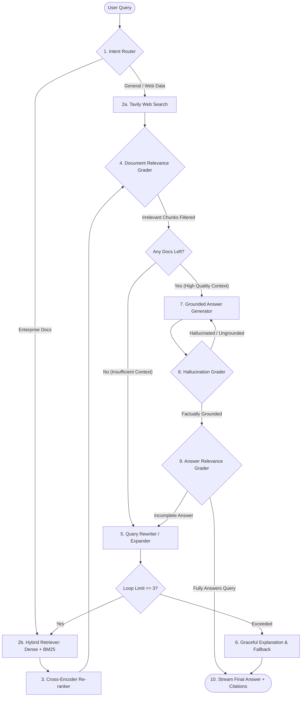

# AXIOM: Production-Grade Agentic RAG Platform
### Powered by the SCORE Engine (Self-COrrecting Reasoning Engine)
> **Tagline**: *"Beyond Retrieval. Towards Certainty."*  
> **Status**: Finalized Specification (Step 1 Complete)

---

## 1. Brand Identity & Design System

### 1.1 Brand Positioning & Pillars
* **Platform Name**: **Axiom** (or **AxiomRAG**)
* **Engine Framework**: **SCORE** (*Self-COrrecting Reasoning Engine* / `score-rag`)
* **Positioning**: Enterprise-grade self-correcting RAG infrastructure delivering mathematically grounded, verifiable, and zero-hallucination intelligence over complex, high-stakes documents.
* **Core Brand Identity**: Authoritative, precise, verifiable, transparent, and resilient.
* **Brand Voice**: **Epistemic Humility**.
  * The system never bluffs, assumes, or generates speculative filler.
  * Every statement is deterministically tied to verified chunk/document citations.
  * If context is contradictory or absent after exhaustive re-retrieval, the system explicitly explains its reasoning and limits rather than guessing.

### 1.2 Design Tokens & Semantic Color Palette
Designed for high-density enterprise interfaces with accessible contrast ratios (WCAG AA compliant):

| Token Name | Hex Code | Semantic Role |
| :--- | :--- | :--- |
| `--bg-canvas` | `#0A192F` | Deep Navy: Primary application background |
| `--bg-surface` | `#112240` | Slate Surface: Cards, sidebars, and elevated panels |
| `--border-subtle` | `#233554` | Slate Outline: Dividers, borders, and input strokes |
| `--text-primary` | `#FFFFFF` | Crisp White: Primary headers and hero copy |
| `--text-secondary` | `#CCD6F6` | Soft Platinum: High-contrast body text and answers |
| `--text-muted` | `#8892B0` | Slate Muted: Metadata, timestamps, and secondary info |
| `--accent-ai` | `#00D8FF` | Electric Cyan: Agent reasoning loops, routing state, active glow |
| `--status-verified` | `#10B981` | Emerald Green: Grounded answer passed, zero hallucination |
| `--status-warning` | `#F59E0B` | Amber: Self-correction triggered, query rewrite in progress |
| `--status-rejected` | `#EF4444` | Coral Red: Irrelevant context discarded, hallucination caught |

### 1.3 Typography System
* **Display & Headings**: *Plus Jakarta Sans* or *Inter* (Semi-bold / Bold, modern, clean, geometric)
* **UI & Body**: *Inter* (Highly legible at small sizes, optimal for dense enterprise data)
* **Code, Citations & State Logs**: *JetBrains Mono* or *Fira Code* (For JSON payloads, chunk IDs, and reasoning traces)

---

## 2. Target Market & The Real-Life Problem

### 2.1 Target Audience
* **Enterprise Risk & Compliance Teams**: Legal counsel, audit officers, and corporate policy managers.
* **Financial & Investment Analysts**: Private equity, equity research, and M&A teams cross-referencing multi-year filings.
* **AI & Engineering Teams**: Engineering organizations requiring guaranteed zero-hallucination knowledge retrieval.

### 2.2 The Real-Life Problem We Solve (The "Spearhead" Domain)
Standard RAG systems in production fail catastrophically when encountering complex real-world documents. Axiom specifically solves the **4 Core Failure Modes**:

```
┌────────────────────────────────────────────────────────────────────────┐
│                        STANDARD RAG vs AXIOM                           │
├──────────────────────────────────┬─────────────────────────────────────┤
│ Standard RAG Failure Mode        │ How Axiom (SCORE Engine) Fixes It   │
├──────────────────────────────────┼─────────────────────────────────────┤
│ 1. The Amendment Trap            │ Multi-hop Query Rewriting: Detects  │
│    Retrieves initial agreement,  │ references to addendums and searches│
│    misses superseding amendments.│ until latest active terms are found.│
├──────────────────────────────────┼─────────────────────────────────────┤
│ 2. The Multi-Hop Disconnect      │ Relevance Grading: Evaluates chunk  │
│    Clause references an appendix │ completeness; queries recursively if│
│    located 50 pages away.        │ supporting definitions are missing. │
├──────────────────────────────────┼─────────────────────────────────────┤
│ 3. Table & Footnote Distortion   │ Semantic Chunking + Tabular Guard:  │
│    Financial numbers divorced    │ Preserves table markdown and audits │
│    from qualifying footnotes.    │ numerical claims against raw tables.│
├──────────────────────────────────┼─────────────────────────────────────┤
│ 4. The "Silent Bluff"            │ Dual Hallucination & Relevance Grader:│
│    LLM invents facts when the    │ Rejects ungrounded claims; loops back│
│    retrieved context is sparse.  │ or returns transparent refusal.     │
└──────────────────────────────────┴─────────────────────────────────────┘
```

---

## 3. End-to-End System Architecture

Axiom separates concerns into three distinct layers:
1. **Ingestion & Hybrid Retrieval Layer**
2. **SCORE Agent State Machine (LangGraph)**
3. **Enterprise Streaming & API Gateway (FastAPI)**

### 3.1 LangGraph State Machine Architecture



### 3.2 State Machine Nodes & Responsibilities

| Node | Name | Primary Responsibility | Failure Strategy |
| :---: | :--- | :--- | :--- |
| **01** | `Router` | Classifies query intent: internal vector docs, live web, or direct response. | Defaults to hybrid vector store if ambiguous. |
| **02** | `HybridRetriever` | Combines Dense Vector Search (Qdrant/Pinecone/Chroma) + Sparse BM25. | Returns top-k candidate chunks. |
| **03** | `CrossEncoderReranker` | Reranks candidates using a cross-encoder model to surface highest precision text. | Falls back to dense cosine similarity if service is down. |
| **04** | `DocGrader` | Fast LLM grading (e.g., Gemini Flash) outputting structured binary score (`yes`/`no`) per chunk. | Drops `no` chunks; keeps only verified relevant context. |
| **05** | `QueryRewriter` | Analyzes original query + failed context to generate optimized semantic search query. | Increments loop counter in `AgentState`. |
| **06** | `AnswerGenerator` | High-reasoning model synthesizing response strictly from graded chunks with inline citation IDs. | Must cite source chunk IDs; no uncited assertions. |
| **07** | `HallucinationGrader`| Compares generated draft line-by-line against context to verify 100% factual grounding. | Sends back to generator if hallucinations are found. |
| **08** | `RelevanceGrader` | Verifies whether the grounded answer directly and completely answers the user prompt. | Triggers rewriter if answer is evasive or incomplete. |
| **09** | `FallbackHandler` | Formats transparent failure explanation when maximum retries (3 loops) are exhausted. | Summarizes what was searched, what was missing, and avoids guessing. |

---

## 4. Production Engineering & Operational Standards

### 4.1 Real-time Streaming Protocol
* Agent operations must never feel like a black box. The backend implements **Server-Sent Events (SSE)** via FastAPI.
* **Dual Event Streams**:
  1. `type: "status"`: Emits state events in real time:
     * `{"node": "router", "decision": "vector_store"}`
     * `{"node": "doc_grader", "retained": 3, "discarded": 2}`
     * `{"node": "hallucination_grader", "grounded": true}`
  2. `type: "token"`: Incremental token streaming of the verified final response.

### 4.2 State Persistence & Fault Tolerance
* LangGraph state is checkpointed using **PostgreSQL** (`AsyncPostgresSaver`) or **Redis** (`RedisSaver`).
* Enables auditability, conversational memory, thread resumption, and human-in-the-loop approvals.

### 4.3 Automated Evaluation & Benchmarking (CI/CD)
To guarantee production readiness across updates, the engine runs continuous automated benchmarks using **Ragas** and **DeepEval**:
* **Faithfulness Metric**: Target $\ge 0.95$ (Near-zero hallucination).
* **Answer Relevance**: Target $\ge 0.90$.
* **Context Precision & Recall**: Target $\ge 0.85$.

---

## 5. Production Repository Architecture

```
Agentic Rag/
├── pyproject.toml                     # Modern uv / pip build spec with pinned dependencies
├── .env.example                       # Documented environment variables
├── README.md                          # Production overview, badges & quickstart
├── docs/
│   ├── brand_and_architecture_spec.md # This complete specification
│   ├── api_reference.md               # OpenAPI / SSE streaming specification
│   └── evaluation_guide.md            # Ragas benchmark execution guide
├── src/
│   └── axiom/
│       ├── __init__.py
│       ├── config/                    # Pydantic Settings
│       │   ├── __init__.py
│       │   └── settings.py
│       ├── core/                      # SCORE LangGraph Engine
│       │   ├── __init__.py
│       │   ├── state.py               # Typed AgentState schema
│       │   ├── graph.py               # Graph compilation & checkpointer
│       │   ├── nodes/                 # Discrete node implementations
│       │   │   ├── router.py
│       │   │   ├── retriever.py
│       │   │   ├── grader.py
│       │   │   ├── rewriter.py
│       │   │   ├── generator.py
│       │   │   └── fallback.py
│       │   └── prompts/               # Decoupled Jinja/Markdown prompt templates
│       ├── services/                  # External integrations
│       │   ├── vector_store.py        # Qdrant / Chroma hybrid search
│       │   ├── reranker.py            # Cross-encoder integration
│       │   └── web_search.py          # Tavily search client
│       └── api/                       # FastAPI Server & Routes
│           ├── main.py
│           ├── routes/
│           │   ├── chat.py            # SSE streaming query endpoint
│           │   ├── ingest.py          # Document parsing & indexing
│           │   └── health.py          # Health checks & readiness probes
│           └── schemas/               # Request/Response Pydantic models
├── evals/                             # Golden datasets & automated benchmark runners
│   ├── golden_contracts.json          # Benchmark dataset of tricky multi-hop contracts
│   └── run_evals.py                   # Automated Ragas evaluation script
└── tests/                             # Pytest test suite
    ├── unit/
    └── integration/
```

---

## 6. Execution Roadmap

* [x] **Step 1: Brand & Architecture Specification** (Complete & Finalized)
* [ ] **Step 2: Project Scaffold & Environment Initialization** (Folder layout, `pyproject.toml`, settings)
* [ ] **Step 3: Core SCORE LangGraph State Machine** (Typed `AgentState`, nodes, conditional loops)
* [ ] **Step 4: Vector Store & Hybrid Retrieval Services** (Chroma/Qdrant + BM25 + Re-ranking)
* [ ] **Step 5: FastAPI Gateway & Real-Time SSE Streaming** (Status events + token streaming)
* [ ] **Step 6: Killer Benchmark Showcase & Evals** (Tricky contract/filing test suite with Ragas metrics)
