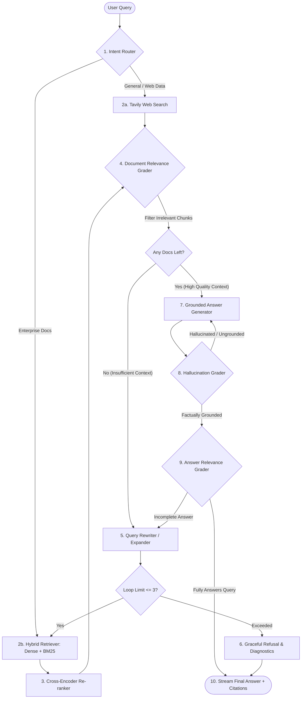

<div align="center">

# ⚡ AXIOM
### Production-Grade Agentic RAG Platform
**Powered by the SCORE Engine (*Self-COrrecting Reasoning Engine*)**

[](https://www.python.org/downloads/)
[](https://github.com/langchain-ai/langgraph)
[](https://fastapi.tiangolo.com)
[]()
[](LICENSE)

> *"Beyond Retrieval. Towards Certainty."*

</div>

---

## 📖 Overview

**Axiom** is an enterprise-grade, self-correcting Retrieval-Augmented Generation (RAG) platform. Powered by the **SCORE Engine** (*Self-COrrecting Reasoning Engine*), Axiom replaces fragile, one-shot vector search pipelines with a stateful, cyclical multi-agent graph that audits, critiques, and refines its own retrieval before delivering answers to users.

Standard RAG systems in production achieve roughly 80% accuracy. In mission-critical domains (legal contracts, regulatory compliance, financial audit, clinical protocol), that remaining 20% contains silent, confident hallucinations that destroy enterprise trust. **Axiom guarantees mathematical grounding and zero unverified assertions.**

---

## 🚨 The 4 Real-World RAG Failures Axiom Solves

| Standard RAG Failure Mode | Real-Life Disaster | How Axiom (SCORE Engine) Fixes It |
| :--- | :--- | :--- |
| **1. The Amendment Trap** | Retrieves 2022 Master Agreement, misses 2024 Addendum. Outputs legally void terms. | **Multi-hop Query Rewriter**: Identifies referenced amendments and hunts across documents until the latest active clause is verified. |
| **2. The Multi-Hop Disconnect** | Section 4 refers to Appendix B on page 90. Standard vector search only retrieves Section 4. | **Document Relevance Grader**: Evaluates chunk completeness; recursively retrieves dependent definitions before generation. |
| **3. Table & Footnote Distortion** | Pulls financial numbers from income statement, misses qualifying restructuring footnote. | **Tabular Preserving Parser + Audit Guard**: Audits synthesized financial metrics directly against raw table markdown. |
| **4. The "Silent Bluff"** | Retrieved context is missing the answer. LLM synthesizes convincing, ungrounded filler. | **Dual Hallucination & Relevance Grader**: Rejects ungrounded statements; loops back or returns transparent refusal. |

---

## 🏛️ System Architecture

Axiom executes a 9-node state machine built on **LangGraph**, wrapped in a **FastAPI** gateway with real-time **Server-Sent Events (SSE)** streaming:



---

## 🎨 Brand Identity & Design System

Axiom interfaces use a curated, high-density palette with accessible contrast ratios (WCAG AA compliant):

* **Canvas (`#0A192F`)**: Deep Navy — Primary background
* **Surface (`#112240`)**: Slate Surface — Elevated cards and panels
* **Border (`#233554`)**: Slate Outline — Dividers and focus strokes
* **AI Glow (`#00D8FF`)**: Electric Cyan — Active agent thinking, routing, and loops
* **Verified (`#10B981`)**: Emerald Green — Factual grounding passed, zero hallucination
* **Warning (`#F59E0B`)**: Amber — Self-correction triggered (query rewrite in progress)
* **Rejected (`#EF4444`)**: Coral Red — Irrelevant chunk discarded or hallucination caught

---

## 📂 Project Structure

```
Agentic Rag/
├── docs/                              # Project documentation & architecture specs
│   └── brand_and_architecture_spec.md
├── src/
│   └── axiom/
│       ├── config/                    # Pydantic Settings & environment config
│       ├── core/                      # SCORE LangGraph Engine
│       │   ├── state.py               # Typed AgentState schema
│       │   ├── graph.py               # Graph assembly & checkpointer
│       │   ├── nodes/                 # Discrete node implementations
│       │   └── prompts/               # Decoupled Jinja/Markdown prompt templates
│       ├── services/                  # Hybrid vector store, reranker, web search
│       └── api/                       # FastAPI server, schemas & SSE streaming
├── evals/                             # Golden datasets & automated Ragas benchmark runners
├── tests/                             # Pytest unit & integration suites
├── CONTEXT.md                         # Deep domain context for developers & AI assistants
├── TECH_STACK.md                      # Detailed justification for every tech choice
├── ROADMAP.md                         # Multi-phase project roadmap
├── TODO.md                            # Granular execution checklist
├── AGENTS.md                          # Universal AI assistant rules & conventions
└── DECISIONS.md                       # Architectural Decision Records (ADRs)
```

---

## 🚀 Quick Start (Development)

### Prerequisites
* Python 3.10+
* [uv](https://github.com/astral-sh/uv) (recommended) or `pip`

```bash
# Clone and navigate to workspace
cd "Agentic Rag"

# Setup virtual environment
python -m venv .venv
source .venv/bin/activate  # On Windows: .venv\Scripts\activate

# Install dependencies (once pyproject.toml is generated)
pip install -e .
```

### Environment Configuration
Copy `.env.example` to `.env` and provide your API keys:
```env
OPENAI_API_KEY=your_key_here
# or GEMINI_API_KEY=your_key_here
TAVILY_API_KEY=your_key_here
LANGSMITH_API_KEY=your_key_here
```

---

## 📚 Essential Documentation

* [Brand & Architecture Specification](docs/brand_and_architecture_spec.md): Complete engineering specification.
* [1M Customer Scaling Architecture (SCALING_ARCHITECTURE.md)](SCALING_ARCHITECTURE.md): Distributed systems design for 1M users.
* [Domain Context (CONTEXT.md)](CONTEXT.md): Background on why standard RAG fails and the problems we solve.
* [Technology Stack Justifications (TECH_STACK.md)](TECH_STACK.md): Comprehensive breakdown of why each tech was chosen.
* [Architectural Decisions (DECISIONS.md)](DECISIONS.md): Formal Architecture Decision Records (ADRs).
* [Project Roadmap (ROADMAP.md)](ROADMAP.md) & [Execution Checklist (TODO.md)](TODO.md): Progress tracking.
* [AI Assistant Rules (AGENTS.md)](AGENTS.md): Universal guide for AI pair programmers.
