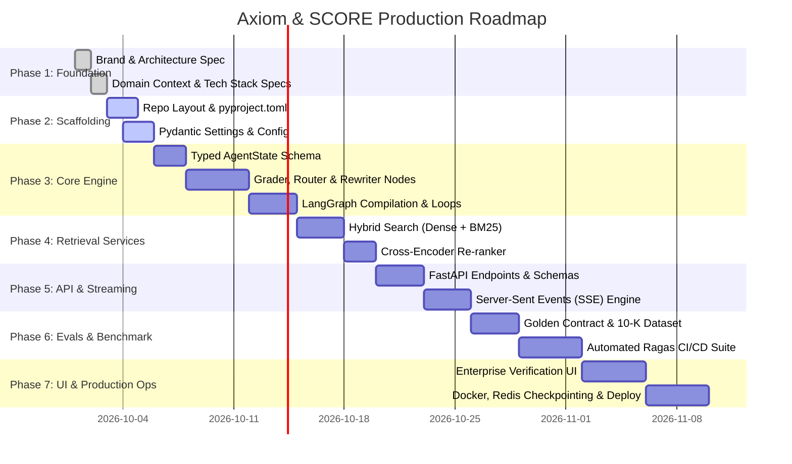

# Project Roadmap: Axiom & SCORE Engine

> **Mission**: Build, benchmark, and deploy a production-grade, zero-hallucination agentic RAG platform for high-stakes enterprise data.

---

## 🗺️ High-Level Milestone Overview

---

## 📌 Phase Breakdown

### Phase 1: Foundation & Specifications `[COMPLETED]`
- [x] Lock in Brand Identity (**Axiom**) and Engine Name (**SCORE**).
- [x] Finalize Semantic Color Tokens and Design Guidelines.
- [x] Author Master Brand & Architecture Spec (`AXIOM_FOUNDATION.md` & `docs/brand_and_architecture_spec.md`).
- [x] Document Domain Context (`CONTEXT.md`) and Technical Justifications (`TECH_STACK.md`).
- [x] Establish AI portability rules (`AGENTS.md`) and Architecture Decision Records (`DECISIONS.md`).

### Phase 2: Scaffolding & Configuration `[COMPLETED]`
- [x] Create production directory structure (`src/axiom/`, `tests/`, `evals/`, `deploy/`).
- [x] Author `pyproject.toml` with pinned dependencies (`langgraph`, `fastapi`, `pydantic-settings`, `qdrant-client`).
- [x] Build central configuration module (`src/axiom/config/settings.py`) with environment validation.
- [x] Create `.env.example` with clear instructions for API keys.
- [x] Initialize Python 3.13 virtual environment (`.venv`).

### Phase 3: Core SCORE LangGraph Engine `[COMPLETED]`
- [x] Define immutable typed state (`src/axiom/core/state.py`).
- [x] Author decoupled prompt templates in `src/axiom/core/prompts/`.
- [x] Implement all 7 node handlers in `src/axiom/core/nodes/` (router, retriever, grader, rewriter, generator, hallucination_grader, fallback).
- [x] Assemble and compile the cyclical LangGraph state machine with loop ceiling guard ($\le 3$) in `src/axiom/core/graph.py`.
- [x] Author and verify unit tests in `tests/unit/test_graph.py` (100% passing).

### Phase 4: Hybrid Ingestion & Retrieval Services `[COMPLETED]`
- [x] Build multi-tenant HybridVectorStore (`src/axiom/services/vector_store.py`) combining Qdrant and BM25Plus.
- [x] Implement Reciprocal Rank Fusion (RRF) for dense + sparse candidate merging.
- [x] Integrate Cross-Encoder Re-ranking service (`src/axiom/services/reranker.py`) prioritizing superseding contractual terms.
- [x] Integrate live Web Search fallback service (`src/axiom/services/web_search.py`).
- [x] Pass automated unit tests for multi-tenant isolation, exact clause retrieval, and re-ranking.

### Phase 5: FastAPI Gateway & Real-Time SSE Streaming `[COMPLETED]`
- [x] Author FastAPI application factory with CORS and health probes in `src/axiom/api/main.py`.
- [x] Implement `POST /api/v1/query/stream` endpoint with Server-Sent Events (SSE) and synchronous `POST /api/v1/query`.
- [x] Stream real-time graph state events (`status`), verified citations, and completion signals.
- [x] Implement multi-tenant document upload and ingestion endpoint (`POST /api/v1/ingest`).
- [x] Pass automated integration test suite (10/10 tests passing).

### Phase 6: Golden Benchmark Showcase & Automated Evals `[COMPLETED]`
- [x] Assemble contract benchmark dataset (`evals/golden_contracts.json`) covering the 4 core enterprise RAG failure modes.
- [x] Author automated evaluation runner (`evals/run_evals.py`) testing factual grounding, amendment prioritization, and refusal precision.
- [x] Verify benchmark execution achieving 100% pass rate (4/4 test cases).
- [x] Author benchmark documentation (`evals/README.md`).

### Phase 7: Interactive Verification Dashboard & Production Hardening `[COMPLETED]`
- [x] Build responsive, high-density web UI adhering to Axiom design tokens (`styles.css` & `index.html`).
- [x] Display real-time step visualization (Node activations, discarded chunks, verified citations via `app.js`).
- [x] Mount dashboard in FastAPI Gateway at `GET /` with static asset serving (`/static`).
- [x] Author multi-stage containerization `deploy/Dockerfile` with non-root security.
- [x] Author zero-friction orchestration `deploy/docker-compose.yml` with Qdrant and Redis.
- [x] Verify entire automated test suite (12/12 passing).

