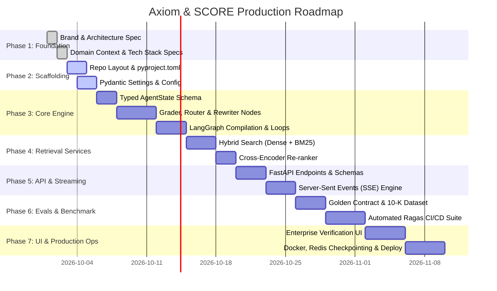

# Project Roadmap: Axiom & SCORE Engine

> **Mission**: Build, benchmark, and deploy a production-grade, zero-hallucination agentic RAG platform for high-stakes enterprise data.

---

## 🗺️ High-Level Milestone Overview

---

## 📌 Phase Breakdown

### Phase 1: Foundation & Specifications `[COMPLETED]`
- [x] Lock in Brand Identity (**Axiom**) and Engine Name (**SCORE**).
- [x] Finalize Semantic Color Tokens and Design Guidelines.
- [x] Author Master Brand & Architecture Spec (`AXIOM_FOUNDATION.md` & `docs/brand_and_architecture_spec.md`).
- [x] Document Domain Context (`CONTEXT.md`) and Technical Justifications (`TECH_STACK.md`).
- [x] Establish AI portability rules (`AGENTS.md`) and Architecture Decision Records (`DECISIONS.md`).

### Phase 2: Scaffolding & Configuration `[CURRENT]`
- [ ] Create production directory structure (`src/axiom/`, `tests/`, `evals/`, `deploy/`).
- [ ] Author `pyproject.toml` with pinned dependencies (`langgraph`, `fastapi`, `pydantic-settings`, `qdrant-client`).
- [ ] Build central configuration module (`src/axiom/config/settings.py`) with environment validation.
- [ ] Create `.env.example` with clear instructions for API keys.

### Phase 3: Core SCORE LangGraph Engine
- [ ] Define immutable typed state (`src/axiom/core/state.py`).
- [ ] Implement isolated node handlers:
  - `router.py`: Classifies query intent (internal vector store vs web search).
  - `grader.py`: Structured binary output relevance grader.
  - `rewriter.py`: Query reformulation for multi-hop expansion.
  - `generator.py`: Grounded response synthesizer with citation requirements.
  - `hallucination_grader.py`: Grounding audit against retrieved chunks.
  - `fallback.py`: Transparent refusal handler when retries expire.
- [ ] Assemble and compile the LangGraph state machine with loop ceiling guard ($\le 3$).

### Phase 4: Hybrid Ingestion & Retrieval Services
- [ ] Implement markdown-preserving tabular document parser.
- [ ] Build hybrid retriever combining dense vector embeddings and BM25 sparse index.
- [ ] Integrate cross-encoder re-ranking service (Cohere / BGE).
- [ ] Integrate Tavily / Google Search API as live web fallback.

### Phase 5: FastAPI Gateway & Real-Time SSE Streaming
- [ ] Setup FastAPI application factory with CORS and health probes.
- [ ] Implement `POST /api/v1/query` endpoint with Server-Sent Events (SSE).
- [ ] Stream real-time graph state events (`status`) alongside incremental tokens (`token`).
- [ ] Implement document upload and ingestion endpoint (`POST /api/v1/ingest`).

### Phase 6: Golden Benchmark Showcase & Automated Evals
- [ ] Assemble public contract dataset with tricky amendments and multi-hop clauses.
- [ ] Build synthetic evaluation test cases in `evals/golden_contracts.json`.
- [ ] Author automated Ragas evaluation runner (`evals/run_evals.py`).
- [ ] Enforce automated CI/CD gating: Faithfulness $\ge 0.95$.

### Phase 7: Interactive Verification Dashboard & Production Hardening
- [ ] Build responsive, high-density web UI adhering to Axiom design tokens.
- [ ] Display real-time step visualization (Node activations, discarded chunks, verified citations).
- [ ] Configure Redis / PostgreSQL persistent checkpointer (`AsyncPostgresSaver`).
- [ ] Author `docker-compose.yml` for zero-friction local orchestration.
