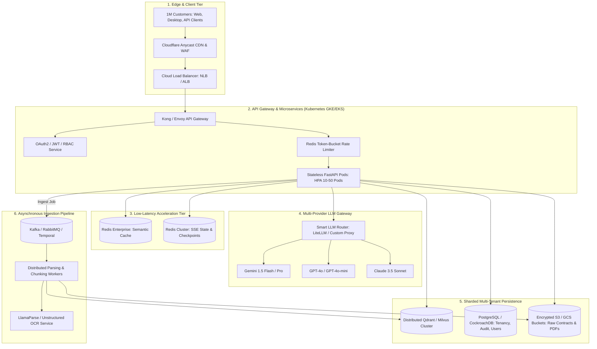
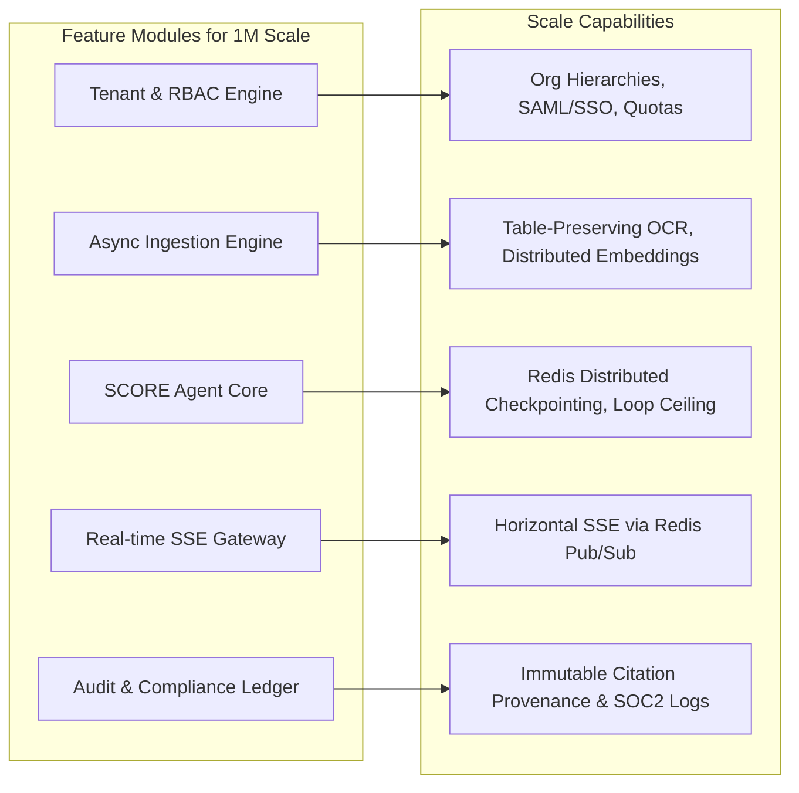

# Scaling Axiom & SCORE to 1 Million Customers
## High-Level & Feature-Level Distributed Systems Architecture

> **Scale Target**: 1,000,000 Registered Enterprise Users / Multi-Tenant Organizations  
> **Throughput**: ~100,000 DAU, 500,000 queries/day, 30–75 Peak QPS, 2M+ Daily Agent LLM Interactions  
> **SLA Target**: 99.95% Availability, p95 Latency < 3.5s (full reflection), p95 Latency < 250ms (cached)

---

## 1. Capacity Planning & Traffic Analysis (The Math of 1M Users)

```
┌─────────────────────────────────────────────────────────────────────────┐
│                       CAPACITY PLANNING METRICS                         │
├──────────────────────────────────────┬──────────────────────────────────┤
│ Metric                               │ Calculated Value                 │
├──────────────────────────────────────┼──────────────────────────────────┤
│ Total Registered Customers           │ 1,000,000                        │
│ Daily Active Users (DAU, 10%)        │ 100,000 DAU                      │
│ Queries per Active User / Day        │ 5 queries / user                 │
│ Total Daily Queries                  │ 500,000 queries / day            │
│ Average QPS                          │ ~6 queries / sec                 │
│ Peak QPS (5x–10x burst factor)       │ 30 – 75 QPS                      │
│ LLM Node Calls per Query (Avg 4)     │ ~2,000,000 LLM calls / day       │
│ Peak LLM Throughput                  │ 150 – 350 LLM calls / sec        │
│ Peak Concurrent SSE Connections      │ 3,000 – 6,000 streaming streams  │
│ Ingestion Volume (Daily uploads)     │ 25,000 docs / day (~2.5M pages)  │
│ Vector Storage Capacity              │ ~50 Million Chunks (~200 GB)     │
└──────────────────────────────────────┴──────────────────────────────────┘
```

---

## 2. High-Level Distributed Architecture (System Topology)

At 1 million customers, a single monolithic server or single vector database node will collapse. The system is divided into **stateless API pods**, **distributed background workers**, **sharded multi-tenant storage**, and a **fault-tolerant LLM gateway**.



---

## 3. Core Architectural Pillars for 1M Scale

### 3.1 Strict Multi-Tenancy & Data Isolation
When serving 1 million customers, **data leak between tenants is a fatal liability**.
* **Storage Isolation**:
  * **Payload-level Isolation**: Every vector in Qdrant has mandatory tenant metadata:
    ```json
    {
      "tenant_id": "org_enterprise_9823",
      "user_id": "usr_4810",
      "document_id": "doc_msa_2024",
      "access_groups": ["legal", "exec"]
    }
    ```
  * **Query Guard**: Every retriever query automatically injects tenant constraints into the vector index query filter. No query can execute without a verified `tenant_id`.
  * **Row-Level Security (RLS)** in PostgreSQL ensures that thread histories, prompts, and audit records are partitioned by `tenant_id`.
  * **Encryption-at-Rest**: Tenant-specific AWS KMS / GCP KMS keys for high-tier enterprise compliance.

### 3.2 Semantic Caching (Cost & Latency Killer)
At 1M users, 20% to 35% of queries repeat similar questions across organizations or within departments.
* **Mechanism**: Before running the SCORE agent loops, the query embedding is matched against **Redis Enterprise Semantic Cache** using cosine similarity ($\ge 0.96$).
* **Impact**:
  * Latency drops from **3,500ms down to 15ms**.
  * Eliminates **$20,000+ per month in redundant LLM API costs**.
  * Bypasses the LangGraph state machine entirely for known verified answers.

### 3.3 Asynchronous Ingestion & Document Processing
Parsing a 400-page SEC 10-K or a 50-page MSA cannot happen within an HTTP request cycle:
* **Workflow Engine**: **Temporal.io** or **Celery + RabbitMQ**.
* **Job Flow**:
  1. Client uploads file to S3/GCS presigned URL.
  2. Gateway pushes `IngestEvent(tenant_id, file_uri)` to queue.
  3. Distributed worker pool picks up task:
     * PDF OCR and markdown table extraction.
     * Semantic Chunking (preserving table boundaries and footnotes).
     * Parallel batch embedding generation.
     * Dual insertion into Qdrant (dense) and BM25 index (sparse).
  4. Real-time progress updates sent to client over SSE: `{"progress": "chunking", "percentage": 45}`.

### 3.4 Multi-Provider LLM Gateway with Circuit Breakers
At 2M daily LLM calls, third-party provider rate limits or API outages (OpenAI or Gemini 503 errors) are guaranteed to happen weekly:
* **Dynamic Routing**: Primary routes target **Gemini 1.5 Flash / Pro** (fastest TTFT and lowest cost).
* **Circuit Breakers**: If Gemini error rate exceeds 5% in 60 seconds, traffic seamlessly shifts to **GPT-4o / GPT-4o-mini** without dropping active user queries.
* **Token Budget Throttling**: Leaky bucket rate-limiter prevents any single enterprise tenant from exhausting global API quotas.

---

## 4. Feature-Level Architecture Breakdown



### Feature 1: Enterprise Multi-Tenancy & Access Control (RBAC)
* **Organizations, Teams & Workspaces**: Support for hierarchical tenant accounts (Enterprise $\rightarrow$ Department $\rightarrow$ User).
* **SSO / SAML 2.0**: Integration with Okta, Microsoft Entra ID (Azure AD), Google Workspace.
* **Document Permissions**: Granular chunk-level ACLs (e.g., only HR can retrieve compensation addendums).
* **Usage Quotas & Billing**: Real-time metering of token usage, search requests, and storage tiers.

### Feature 2: High-Density Tabular & Multimodal Ingestion
* **Table-Preserving Parser**: Guarantees that multi-column balance sheets and footnote matrices remain structurally intact in Markdown format.
* **Parent-Child Chunking**: Stores small chunks (128 tokens) for vector retrieval precision, linked to large parent contexts (1024 tokens) passed to the generator.
* **Automatic Document Versioning**: Automatically tags documents as "superseded" when newer addendums or amendments are uploaded for the same contract ID.

### Feature 3: SCORE Agent Core with Distributed Checkpointing
* **Distributed Checkpointer**: Replaces in-memory state with **Redis Cluster** (active) + **PostgreSQL** (cold).
* **Concurrency Protection**: Redis distributed locks (`Redlock`) prevent duplicate agent loops when impatient users double-click submit.
* **Strict Loop Ceiling**: Hard cutoff at `loop_count <= 3` with graceful fallback explanation.

### Feature 4: High-Concurrency Server-Sent Events (SSE) Hub
* **The Scale Problem**: 5,000 simultaneous users streaming tokens will exhaust server threads if held open directly on application workers.
* **The Solution**: Stateless FastAPI pods publish streaming chunks to **Redis Pub/Sub channels**. Lightweight ASGI edge workers stream tokens to browsers via persistent HTTP/2 connections without tying up compute workers.

### Feature 5: Immutable Audit & Compliance Ledger
* **Every Claim Grounded**: Every generated sentence is logged with its exact source chunk IDs, document hash, and hallucination score.
* **SOC2 & HIPAA Compliant Logs**: Exportable compliance reports for regulatory audits (e.g., proving exactly why an automated system approved or rejected a clause).

---

## 5. Deployment & Infrastructure Blueprint

```
                      [Global Route53 / Cloudflare DNS]
                                     │
                      [Cloudflare Anycast Edge / WAF]
                                     │
                     [AWS ALB / GCP Cloud Load Balancer]
                                     │
         ┌───────────────────────────┴───────────────────────────┐
         ▼                                                       ▼
   [EKS / GKE Cluster: us-east-1]                         [EKS / GKE Cluster: eu-central-1]
   ├── 10-50x FastAPI Web Pods                            ├── 10-50x FastAPI Web Pods
   ├── 5-20x Ingestion Workers                            ├── 5-20x Ingestion Workers
   ├── Redis Cluster (Active State)                       ├── Redis Cluster (Active State)
   └── Qdrant Distributed (Vector Nodes)                  └── Qdrant Distributed (Vector Nodes)
         │                                                       │
         └───────────────────────────┬───────────────────────────┘
                                     ▼
                      [Global Storage & Sync Tier]
                      ├── Multi-Region PostgreSQL (Aurora / Cockroach)
                      ├── S3 / GCS Multi-Region Buckets (Raw Documents)
                      └── Datadog / OpenTelemetry / LangSmith Tracing
```

---

## 6. Key Takeaways for our Codebase

To support 1 million customers from Day 1:
1. **Never use global memory for graph state**: All state must pass through typed `AgentState` serializable to Redis/Postgres.
2. **Every database schema must include `tenant_id`**: Vector collections, document stores, and API requests must enforce multi-tenant isolation.
3. **Ingestion must be asynchronous**: API endpoints accept the file and return a `job_id`; background workers do the heavy lifting.
4. **Semantic cache must sit in front of the agent graph**: Save LLM costs and deliver sub-second responses for popular queries.
